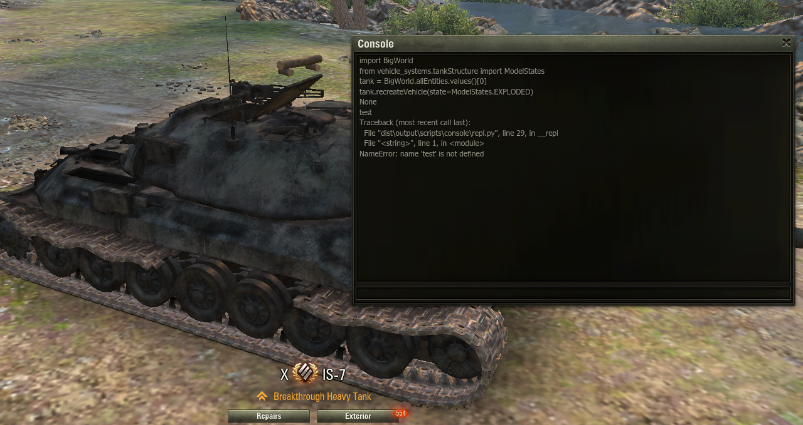

# World of tanks console mod

This is a mod for the game World of Tanks. It allows you to launch a window containing a console to execute commands.
You can also use the console to execute commands from the game.

## Usage

Just press **F10** when the game is running to open the console

## Installation

Download the latest release from the release pages and put the .wotmod file in the mods folder of the game.
(eg. C:\Games\World_of_Tanks_EU\mods\1.19.1.0)

## License

[MIT](./LICENSE.txt)
